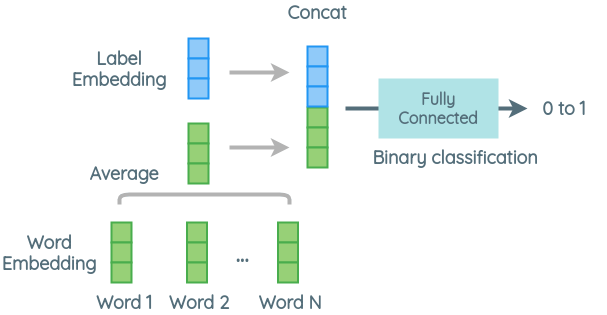

# Happify AI Team Coding Interview

Please **DO NOT** share or discuss the assignments.

For any further questions, feel free to contact me. thomas@happify.com

### Question 2

**W2V-based Zero-shot Text Classification** 

**Be creative.**

### Answer 2 

The solution was implemented according to the given modeling steps and with a reference to the paper: 
["Train Once, Test Anywhere: Zero-Shot Learning for Text Classification"](https://arxiv.org/abs/1712.05972). 

Throughout the documentation, I often refer to each piece of headline news in `text` column as a **document** 
and each keyword as a **concept**

A Jyputer notebook (`W2V-based Zero-shot Text Classification.ipynb`) was created to better illusrate
the following steps: 

   - Exploratory Data Analysis (EDA)
   - Computing Doc2vec 
   - Cluster Analysis
   - Generating Document-Concept Vectors
   - Training DNN

In particular, the following are the primary modules in this demo: 

   - data_pipeline.py: 
      - EDA 
      - Generating document vectors for clustering 
      - Generating document-concept vectors for classificaiton

      The main entry point is at `run_data_pipeline()`, which generates all the required training data 
      Set `test_mode` to True for a quick run with a small sample size

   - model.py: 
      - DNN
      - Test functions for validating the preditability of the document-concept vectors using other classical ML methods 
      - Test functions for the proposed DNN with other data sets

      The main entry point is at `run_modeling_pipeline()`

   - cluster.py: 
      - clustering algorithms (e.g. HDBSCN, k-means, spectral clustering)
      - cluster evaluations (e.g. silhouette scores)
 
      See `demo_clustering()` for an example cluster analysis

   Other supportive modules: 

   - evaluate: Evaluate the output of a classifier
   - cluster_utils: utility functions for clustering 
   - learn_manifold: non-linear embeddings for high-dimensional data e.g. T-SNE
   - sampling_utils: utility functions for sampling
   - utils: misc 

For more details, please refer to the notebook `W2V-based Zero-shot Text Classification.ipynb`

### Installation

1. Unzip `zero_shot.zip` and cd to zero_shot containing all source codes
2. Make a copy of the source data (`news_data.csv`) and keep it under `zero_shot/data`
  - the source data is not included in this zip file to save space

3. Also download Google news W2V [here](https://drive.google.com/file/d/0B7XkCwpI5KDYNlNUTTlSS21pQmM/edit) and keep it 
   directly under the project directory i.e. `zero_shot/`

4. Run `pip install -r requirements.txt`

You may be seeing a longer list of dependent packages in requirement.txt ...

All modules were tested on a new Macbook Pro with the Apple M1 chip. Since the standard version of Tensorflow has not yet supported
the M1 chip, the installation for Tensorflow is a bit more involved: 

1. [Miniforge](https://github.com/conda-forge/miniforge#miniforge3) was installed to support Python on arm64 architecture.

2. An `environment.yml` file (included) was used to create a specialized enviornment (`zero_shot`) for running Tensorflow
   
   E.g. conda env create --file=environment.yml --name=zero_shot

3. Then an appropriate version of Tensorflow was pip-installed along with its dependent packages via the following command: 

pip install --upgrade --force --no-dependencies https://github.com/apple/tensorflow_macos/releases/download/v0.1alpha3/tensorflow_macos-0.1a3-cp38-cp38-macosx_11_0_arm64.whl https://github.com/apple/tensorflow_macos/releases/download/v0.1alpha3/tensorflow_addons_macos-0.1a3-cp38-cp38-macosx_11_0_arm64.whl

4. Additionally, make sure the following supporting packages are installed (but they should already be included in `requirements.txt`): 

   - NLTK v3.6+ 
   - Gensim v4.0+
     - Also run `pip install python-Levenshtein` to avoid a warning 
   - HDBSCAN
     - pip install HDBSCAN 

